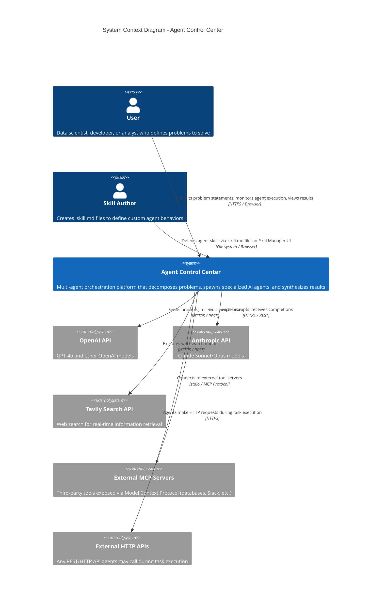
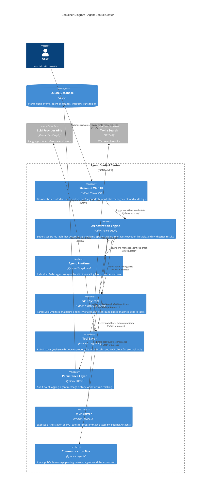
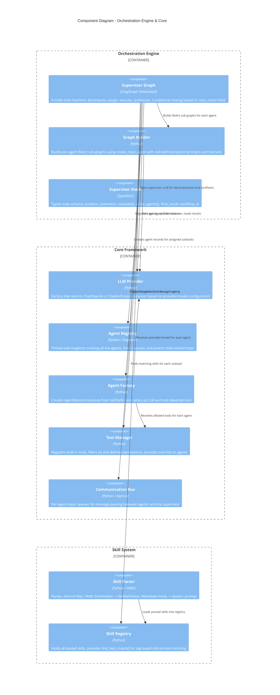
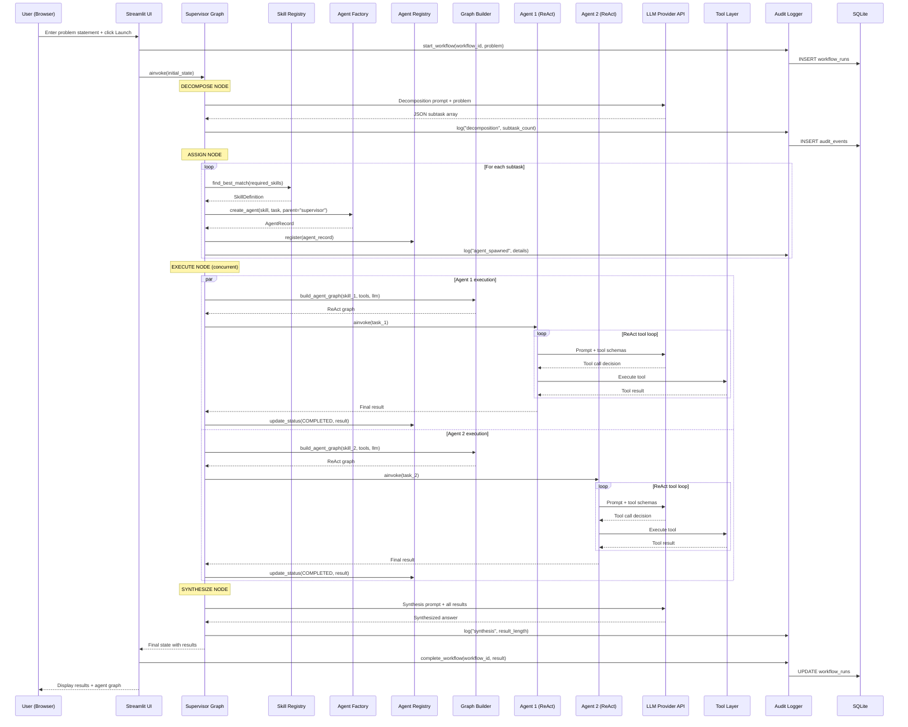
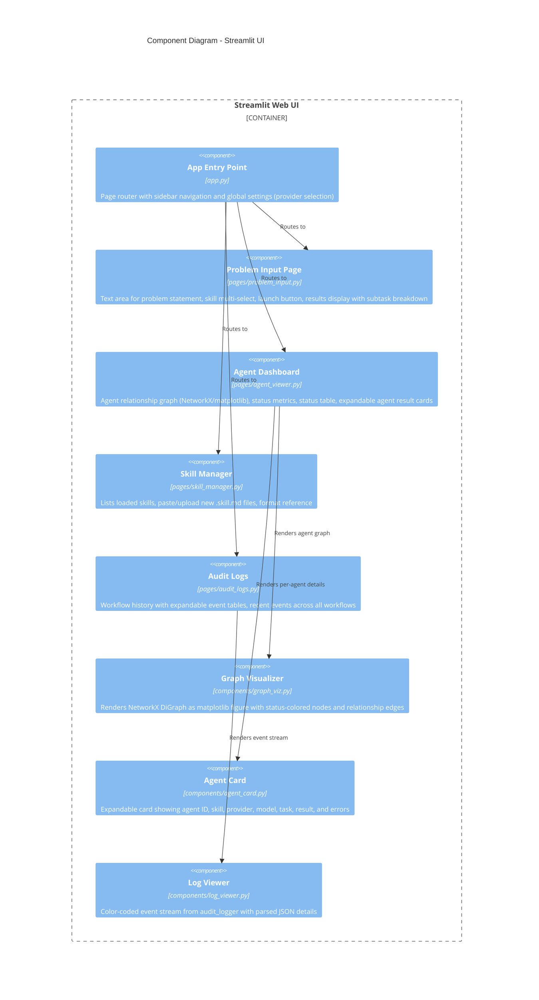
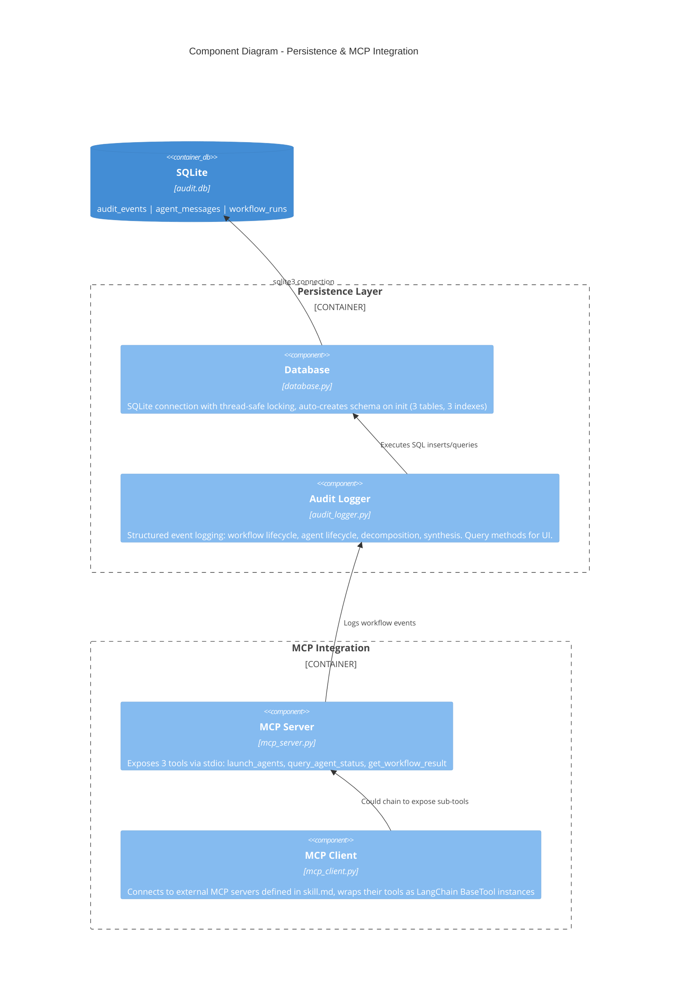
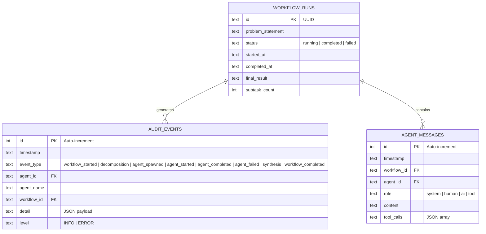
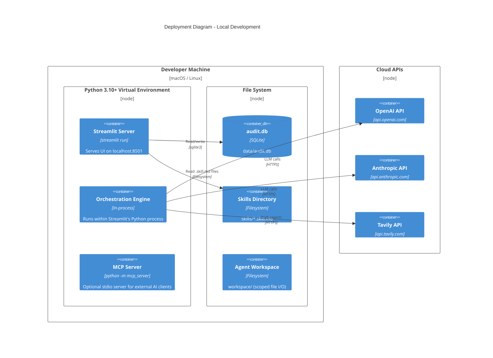

# Agent Control Center - C4 Architecture Documentation

This document describes the architecture of the Autonomous Agent Control Center using the [C4 model](https://c4model.com/) standard: **Context**, **Container**, **Component**, and **Code** diagrams.

All diagrams use [Mermaid](https://mermaid.js.org/) syntax and render natively on GitHub, GitLab, and most documentation platforms.

---

## Level 1: System Context Diagram

The highest-level view showing the Agent Control Center and its external actors/systems.



### Context Narrative

The **Agent Control Center** sits at the intersection of a human user and multiple AI model providers. A user describes a problem in natural language. The system uses an LLM to decompose that problem into independent subtasks, matches each subtask to a specialized agent skill, executes all agents concurrently (each backed by its own LLM call with tool access), and synthesizes the collective results into a unified answer. The system also exposes its orchestration capabilities via MCP, allowing external AI clients (Claude Desktop, other agents) to invoke it programmatically.

---

## Level 2: Container Diagram

Zooms into the Agent Control Center to show its major runtime containers.



### Container Responsibilities

| Container | Technology | Responsibility |
|---|---|---|
| **Streamlit Web UI** | Streamlit 1.40+ | 4 pages: Problem Input, Agent Dashboard, Skill Manager, Audit Logs. Renders agent relationship graphs via NetworkX/matplotlib. |
| **Orchestration Engine** | LangGraph StateGraph | The supervisor pattern: `decompose` -> `assign` -> `execute` -> `synthesize` -> `END`. Manages the full lifecycle of a workflow run. |
| **Agent Runtime** | LangGraph `create_react_agent` | Each sub-agent is a lightweight ReAct loop with access to tools defined by its skill. Runs concurrently via `asyncio.gather`. |
| **Skill System** | YAML + Markdown parser | Reads `.skill.md` files (YAML frontmatter for config, Markdown body for system prompt), maintains a searchable registry with tag-based matching. |
| **Tool Layer** | LangChain tools | Wraps built-in tools (Tavily search, subprocess code execution, scoped file I/O, httpx API calls) and connects to external MCP servers. |
| **Persistence Layer** | SQLite | Three tables: `audit_events` (structured event log), `agent_messages` (conversation history), `workflow_runs` (workflow status and results). |
| **MCP Server** | MCP SDK (stdio) | Exposes `launch_agents`, `query_agent_status`, `get_workflow_result` as MCP tools for external consumption. |
| **Communication Bus** | asyncio Queue | Async pub/sub enabling inter-agent messaging with correlation IDs. Supports targeted and broadcast message patterns. |

---

## Level 3: Component Diagram

Zooms into the Orchestration Engine and Core modules to show internal components and their interactions.



### Component Details

#### Supervisor Graph (`orchestration/supervisor.py`)

The supervisor is the central orchestration component implemented as a LangGraph `StateGraph` with four nodes:

```
[Entry] --> decompose --> assign --> execute --> synthesize --> [END]
```

| Node | Input | Output | Description |
|---|---|---|---|
| `decompose` | Problem statement + available skills | Subtask list | Uses LLM to break problem into independent subtasks with required skill tags |
| `assign` | Subtask list | Agent IDs + updated subtasks | Matches each subtask to best skill via `SkillRegistry.find_best_match()`, creates agents via `AgentFactory` |
| `execute` | Assigned subtasks | Completed subtasks with results | Runs all agents concurrently via `asyncio.gather()`, each as a ReAct sub-graph |
| `synthesize` | All subtask results | Final synthesized answer | Uses LLM to combine all agent outputs into a coherent response |

#### Agent Registry (`core/agent_registry.py`)

- **Pattern**: Thread-safe singleton (required because Streamlit re-runs scripts on interaction)
- **State**: `_agents: dict[str, AgentRecord]` + `_relationships: list[tuple[str, str, str]]`
- **Operations**: `register()`, `update_status()`, `get_agent()`, `get_all()`, `get_children()`, `get_relationships()`

#### Skill Registry (`skills/skill_parser.py`)

- **Matching algorithm**: Scores skills by tag overlap, name/description substring match, and tool overlap with required capabilities
- **Fallback**: Returns `DEFAULT_WORKER_SKILL` (general-purpose agent) when no match is found

---

## Level 4: Code Diagram

Zooms into the data flow of a single workflow execution.



---

## Level 3b: Component Diagram - UI Layer



---

## Level 3c: Component Diagram - Persistence & MCP



---

## Data Model (Entity Relationship)



---

## Deployment View



---

## Architecture Decision Records (ADRs)

### ADR-001: LangGraph StateGraph over LangChain AgentExecutor

**Context**: The supervisor needs to manage multi-step orchestration with state tracking across decomposition, assignment, execution, and synthesis.

**Decision**: Use LangGraph `StateGraph` with explicit nodes and conditional edges.

**Rationale**: LangChain's `AgentExecutor` is designed for single-agent tool-calling loops. It cannot express multi-stage workflows with aggregate state (e.g., "are all subtask agents done?"). LangGraph provides typed state, conditional routing, and composable sub-graphs.

### ADR-002: SQLite for Audit Persistence

**Context**: Need durable audit logging that survives process restarts.

**Decision**: SQLite with thread-safe locking.

**Rationale**: Zero-configuration, file-based, adequate for single-process deployments. Avoids external database dependencies. Can be replaced with PostgreSQL for production scale (see Scalability section in README).

### ADR-003: Singleton Pattern for Agent Registry

**Context**: Streamlit re-executes the entire script on each user interaction. Multiple components need consistent access to the same agent state.

**Decision**: Thread-safe singleton with class-level lock.

**Rationale**: Ensures all UI pages and background tasks see the same agent registry. The `reset()` class method enables clean testing.

### ADR-004: skill.md Format with YAML Frontmatter

**Context**: Need a user-friendly format for defining custom agent skills.

**Decision**: YAML frontmatter (config) + Markdown body (system prompt), using `.skill.md` file extension.

**Rationale**: Familiar format (matches Hugo, Jekyll, Claude SKILL.md conventions). Separates structured metadata from free-form prompt content. Markdown body renders well in editors and documentation.

### ADR-005: NetworkX + matplotlib for Graph Visualization

**Context**: Need to visualize agent relationship graphs in the dashboard.

**Decision**: Use NetworkX for graph data structure, matplotlib for rendering, displayed via `st.pyplot()`.

**Rationale**: Pure Python stack, no JavaScript build step required. Adequate for the expected graph size (1 supervisor + N worker agents per workflow, typically N < 10). For larger deployments, can be upgraded to Graphviz, Pyvis, or a React-based D3 component.
